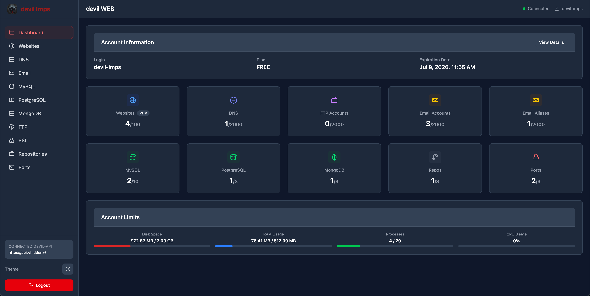

# devil WEB - API Client

A Progressive Web App (PWA) client for managing [devil API](https://github.com/devil-imps/devil-api) services, built with SvelteKit, TypeScript, and Tailwind CSS v4.

## Screenshot



## Getting Started

### Prerequisites

- Node.js 20+
- pnpm (recommended) or npm
- A [devil API](https://github.com/devil-imps/devil-api/tree/v0.3.0) v0.3.0 service available and accessible

### Installation

1. Clone the repository:

```sh
git clone https://github.com/devil-imps/devil-web.git
cd devil-web
```

2. Install dependencies:

```sh
pnpm install
```

3. Start the development server:

```sh
pnpm dev
```

4. Open your browser and navigate to `http://localhost:5173`

### Building for Production

```sh
pnpm build
```

The built application will be in the `build` directory, ready for deployment as a static site.

## Configuration

### Environment Variables

- `BASE_PATH`: Base path for GitHub Pages deployment (e.g., `/devil-web`)

### PWA Configuration

The PWA manifest is located at `static/manifest.json`. You can customize:

## Development

### Code Quality

- **TypeScript**: Full type safety throughout the application
- **ESLint**: Code linting with TypeScript support
- **Prettier**: Code formatting

### Build Commands

```sh
# Development
pnpm dev          # Start development server
pnpm check        # TypeScript checking
pnpm check:watch  # TypeScript checking in watch mode

# Quality checks
pnpm lint         # ESLint checking
pnpm format       # Prettier formatting

# Production
pnpm build        # Build for production
pnpm preview      # Preview production build locally
```

### Adding New Features

1. **Components**: Add new Svelte components in `src/lib/components/`
2. **Services**: Add business logic in `src/lib/services/`
3. **Stores**: Manage state in `src/lib/stores/`
4. **Routes**: Create new routes in `src/routes/` using SvelteKit conventions
5. **Styling**: Use Tailwind CSS v4 classes with PostCSS configuration

### Architecture Patterns

- **State Management**: Svelte stores for global state (`appState`, `theme`)
- **API Integration**: Custom utility functions (`apiGet`, `apiPost`, etc.)
- **Component Communication**: Event dispatcher pattern for parent-child communication
- **Modal System**: Reusable modal components with confirmation patterns
- **Navigation**: Custom `navigateTo()` utility for base path-aware routing

## Technology Stack

- **Framework**: SvelteKit with static adapter for PWA deployment
- **Language**: TypeScript with strict type checking
- **Styling**: Tailwind CSS v4 (via PostCSS plugin)
- **Package Manager**: pnpm (recommended)
- **Deployment**: Static site generation for GitHub Pages compatibility
- **State Management**: Svelte stores with reactive patterns
- **API Integration**: Custom utility functions with Bearer token authentication

## Browser Support

- Chrome/Edge 88+
- Firefox 78+
- Safari 14+
- Mobile browsers with PWA support

## Contributing

Contributions, issues, and feature requests are welcome! Feel free to check the issues page or submit a pull request.

## License

This project is licensed under the GNU AFFERO GENERAL PUBLIC LICENSE. See the [LICENSE](LICENSE) file for details.
